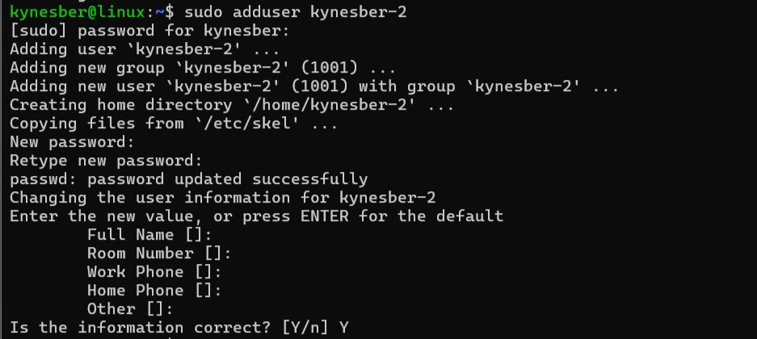
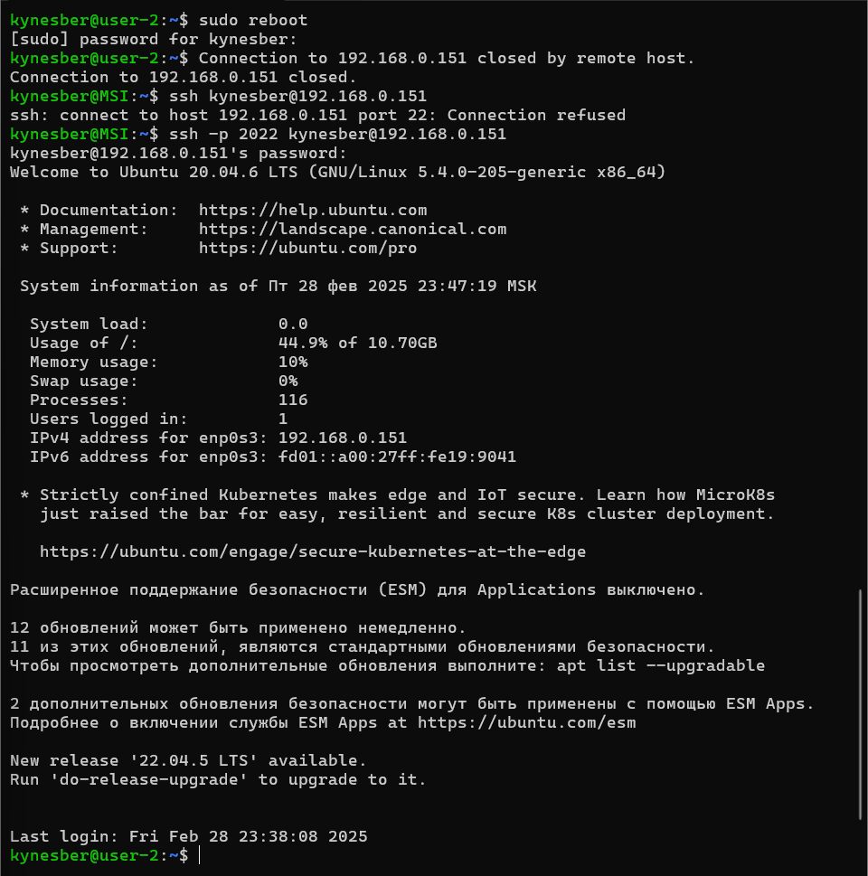

## Part 1. Установка ОС

**== Задание ==**

**Установи Ubuntu 20.04 Server LTS без графического интерфейса. (Используем программу для виртуализации - VirtualBox)**

- Графический интерфейс должен отсутствовать.

- Узнай версию Ubuntu, выполнив команду
  cat /etc/issue.

- Вставь скриншот с выводом команды.

Скачиваем образ Ubuntu 20.04 Server LTS на официальном сайте Ubuntu https://ubuntu.com/download/server.

Создаем новую виртуальную машину в VirtualBox.

Настраиваем виртуальную машину.

В разделе "Система" проверяем, что опция "Включить EFI" включена.

В разделе "Носители" добавляем скаченный ISO-образ.

В разделе "Сеть" ставим тип подключения "Сетевой мост", чтобы в дальнейшем иметь возможность работать через дескнопную версию Ubuntu.

Установку ssh производим непосредственно во время запуска машины на этапе загрузки дополнительных программ. Если вы этого не сделали, тогда установите в уже запустившейся машине.

С помощью команды ip addr show смотрим адрес.

В дальнейшем для удобства и комфорта вся работа будет выплняться десктопной версии Ubuntu.

Далее в десктопной версии Ubuntu подключаемся к нашей виртуальной машине через ssh. Проверяем версию Ubuntu, для этого отобразим в консоль файл, который содержит информацию о версии операционной системы.

## Part 2. Создание пользователя

**== Задание ==**

**Создай пользователя, отличного от созданного при установке. Пользователь должен быть добавлен в группу adm.**

- Вставь скриншот вызова команды для создания пользователя.

- Новый пользователь должен быть в выводе команды
  cat /etc/passwd

- Вставь скриншот с выводом команды.

Создаем нового пользователя. Используем команду sudo adduser.

- sudo - это комнада, которая позволяет выполнять команды с правами суперпользователя. Это необходимо для выполнения операций, требующих повышенных привилегий.

- adduser - это скрипт, который автоматизирует процесс создания нового пользователя, включая создание домашнего каталога и установку пароля.

Используя команду sudo usermod добавляем пользователя в группу adm.

- usermod - это команда для изменения параментров пользователя.

- -aG - это опция, которая добавляет пользователя в группу. -a означает "append" (добавить), а -G указывает на группу.

Проверяем создание пользователя и его принадлежность к группе adm. Выводим содержимое файла, который содержит информацию о всех пользователях системы. Отображаем все группы, к которым принадлежит пользователь.

## Part 3. Настройка сети ОС

**== Задание ==**

**Задай название машины вида user-1.**

Меняем имя машины с linux на user-1. Исаользуем команду sudo hostnamectl set-hostname.

- hostnamectl — утилита для управления настройками хоста.

- set-hostname — команда для установки нового имени хоста.

Мы можем увидеть, что изменения произошли из вывода команды hostnamectl. Так как сейчас я не перезапускала машину, имя хоста не изменилось в приглашении.

**Установи временную зону, соответствующую твоему текущему местоположению.**

Устанавливаем временную зону с помощью команды sudo timedatectl set-timezone.

- timedatectl — утилита для управления системными настройками времени и даты.

- set-timezone — команда для установки временной зоны.

**Выведи названия сетевых интерфейсов с помощью консольной команды.**

- В отчёте дай объяснение наличию интерфейса lo.

Выводим название сетевых интерфейсов с помощью команды ip link show.

- ip — утилита для управления сетевыми настройками.

- link show — команда для отображения всех сетевых интерфейсов.

lo — это loopback интерфейс, который используется для тестирования сетевых соединений на локальном компьютере. Он всегда имеет IP-адрес 127.0.0.1.

**Используя консольную команду, получи ip адрес устройства, на котором ты работаешь, от DHCP сервера.**

- В отчёте дай расшифровку DHCP.

Получим ip-адрес с помощью команды ip addr show.

- addr - команда для управления и отображения адресов сетевых интерфейсов.

- show - команда для отображения текущих настроек.

DHCP (Dynamic Host Configuration Protocol) — протокол, который автоматически назначает IP-адреса и другие сетевые параметры устройствам в сети.

**Определи и выведи на экран внешний ip-адрес шлюза (ip) и внутренний IP-адрес шлюза, он же ip-адрес по умолчанию (gw).**

Выводим внутренний и внешний ip-адреса шлюза с помощью команд ip route show default и curl ifconfig.me, соответственно.

- route - команда для управления таблицей маршрутизации.

- default - указывает, что нужно отобразить маршрут по умолчанию.

- curl - утилита для передачи данных с использованием различных сетевых протоколов.

- ifconfig.me - URL веб-сервиса, который возвращает внешний IP-адрес устройства, с которого был сделан запрос.

**Задай статичные (заданные вручную, а не полученные от DHCP сервера) настройки ip, gw, dns (используй публичный DNS серверы, например 1.1.1.1 или 8.8.8.8).**

Открываем файл конфигурации сети для Netplan.

- dhcp4: no — отключение DHCP.

- addresses — статический IP-адрес.

- gateway4 — шлюз по умолчанию.

- nameservers — DNS-серверы.

Применяем конфигурацию командой sudo netplan apply.

**Перезагрузи виртуальную машину. Убедись, что статичные сетевые настройки (ip, gw, dns) соответствуют заданным в предыдущем пункте.**

- В отчёте опиши, что сделал для выполнения всех семи пунктов (можно как текстом, так и скриншотами).

- Успешно пропингуй удаленные хосты 1.1.1.1 и ya.ru и вставь в отчёт скрин с выводом команды. В выводе команды должна быть фраза «0% packet loss».

Перезагружаем машину комнадой sudo reboot. После этого наш ssh-клиент закрывается, необходимо дождаться перезагрузки машины и подключить через ssh заново.

Проверяем наши настройки. Для проверки настроек DNS выводим в консоль файл /etc/resolv.conf, который содержит настройки DNS-серверов.

Пингуем удаленные хосты с помощью команды ping.

- -c 4 — опция для отправки 4 пакетов.

## Part 4. Обновление ОС

**== Задание ==**

**Обнови системные пакеты до последней на момент выполнения задания версии.**

- После обновления системных пакетов, если ввести команду обновления повторно, должно появиться сообщение, что обновления отсутствуют;

- Вставь скриншот с этим сообщением в отчёт.

Обновляем системные пакеты командами sudo apt update
и sudo apt upgrade.

- apt - утилита для управления пакетами в Ubuntu.

- update - обновляет список доступных пакетов и их версий из репозиториев.

- upgrade - обновляет все установленные пакеты до последних версий, доступных в репозиториях.

Удаляем ненужные пакеты и очищаем кэш.

- autoremove- удаляет пакеты, которые были установлены автоматически для удовлетворения зависимостей других пакетов, но больше не нужны.

- clean- очищает локальный кэш пакетов, чтобы освободить место на диске.

Повторяем команды обновления, чтобы убедиться, что обновления отсуствуют.

## Part 5. Использование команды sudo

**== Задание ==**

**Разреши пользователю, созданному в Part 2,выполнять команду sudo.**

- В отчёте объясни истинное назначение команды sudo (про то, что это слово - «волшебное», писать не стоит);

- Поменяй hostname ОС от имени пользователя, созданного в пункте Part 2 (используя sudo);

- Вставь скрин с изменённым hostname в отчёт.

Для того, чтобы разрешить пользователю выполнять команду sudo, необходимо отредактировать файл sudoers. Для этого используем команду sudo visudo, где visudo - команда для безопасного редактирования файла sudoers.

Находим строку

#User privilege specification

root ALL=(ALL:ALL) ALL

и добавляем строку

kynesber-2 ALL=(ALL:ALL) ALL.

- ALL=(ALL:ALL) ALL - указывает, что пользователь может выполнять любые команды от имени любого пользователя на любом хосте.

Проверим права sudo для пользователя. Для этого введем команду для переключения на нового пользователя и команду sudo whoami.

- sudo whoami: Команда, которая выполняется с правами суперпользователя и возвращает имя текущего пользователя. Если команда выполнена успешно, мы должны увидеть root.

Определение команды sudo дала в Part 2.

Меняем hostname с user-1 на user-2 таким же способом, как и в Part 3.

## Part 6. Установка и настройка службы времени

**== Задание ==**

**Настрой службу автоматической синхронизации времени.**

- Выведи время часового пояса, в котором ты сейчас находишься.

- Вывод следующей команды должен содержать NTPSynchronized=yes:
  timedatectl show

- Вставь скрины с корректным временем и выводом команды в отчёт.

Установим и настроим systemd-timesyncd.

systemd-timesyncd — это служба, которая автоматически синхронизирует системное время с NTP-серверами.

Включим и запустим службу systemd-timesyncd.

- systemctl - утилита для управления системными службами и состоянием системы в systemd.

- enable - команда для включения службы, чтобы она автоматически запускалась при загрузке системы.

- start - команда для запуска службы.

- status - команда для проверки статуса службы.

Проверим текущие настройки времени и часового пояса командой timedatectl.

Проверим, что системное время синхронизировано с NTP-сервером командой timedatectl show. NTPSynchronized=yes указывает, что системное время синхронизировано с NTP-сервером.

## Part 7. Установка и использование текстовых редакторов

**== Задание ==**

**Установи текстовые редакторы VIM (+ любые два по желанию NANO, MCEDIT, JOE и т.д.)**

Устанавливаем текстовые редакторы vim, nano и mcedit.

- install - установка новых пакетов.

**Используя каждый из трех выбранных редакторов, создай файл test_X.txt, где X -- название редактора, в котором создан файл. Напиши в нём свой никнейм, закрой файл с сохранением изменений.**

- В отчёт вставь скриншоты:

  - Из каждого редактора с содержимым файла перед закрытием;

- В отчёте укажи, что сделал для выхода с сохранением изменений.

Создаем файлы с использованием каждого редактора.

vim:

- Перейдем в режим вставки, нажав i.

- Вводим никнейм.

- Нажимаем Esc для выхода из режима вставки.

- Вводим :wq и нажимаем Enter для сохранения и выхода.

nano:

- Вводим никнейм.

- Нажимаем Ctrl + O для сохранения файла.

- Нажимаем Enter для подтверждения.

- Нажимаем Ctrl + X для выхода.

mcedit:

- Вводим никнейм.

- Нажимаем F2 для сохранения файла.

- Нажимаем F10 для выхода.

**Используя каждый из трех выбранных редакторов, открой файл на редактирование, отредактируй файл, заменив никнейм на строку «21 School 21», закрой файл без сохранения изменений.**

- В отчёт вставь скриншоты:

  - Из каждого редактора с содержимым файла после редактирования;

- В отчёте укажи, что сделал для выхода без сохранения изменений.

vim:

- Переходим в режим вставки, нажав i.

- Заменим никнейм на 21 School 21.

- Нажимаем Esc для выхода из режима вставки.

- Вводим :q! и нажимаем Enter для выхода без сохранения.

nano:

- Заменим никнейм на 21 School 21.

- Нажимаем Ctrl + X для выхода.

- Нажимаем N для отказа от сохранения изменений.

mcedit:

- Заменим никнейм на 21 School 21.

- Нажимаем F10 для выхода.

- Выбираем No для отказа от сохранения изменений.

**Используя каждый из трех выбранных редакторов, отредактируй файл ещё раз (по аналогии с предыдущим пунктом), а затем освой функции поиска по содержимому файла (слово) и замены слова на любое другое.**

- В отчёт вставь скриншоты:

  - Из каждого редактора с результатами поиска слова;

  - Из каждого редактора с командами, введёнными для замены слова на другое.

Для начала отредактируем все файлы как в предыдущем пункте и сохраним.

vim:

Поиск слова:

- Вводим /21 и нажимаем Enter для поиска слова 21.

Замена слова:

Вводим :%s/21/School/g и нажимаем Enter для замены всех вхождений слова 21 на School.

nano:

Поиск слова:

- Нажимаем Ctrl + W для открытия окна поиска.

- Вводим 21 и нажимаем Enter для поиска слова 21.

Замена слова:

- Нажимаем Ctrl + \ для открытия окна замены.

- Вводим 21 в поле "Replace" и School в поле "With".

- Нажимаем A для замены всех вхождений.

mcedit:

Поиск слова:

- Нажимаем F7 для открытия окна поиска.

- Вводим 21 и выбираем "Найти все" для поиска слова 21.

Замена слова:

- Нажимаем F4 для открытия окна замены.

- Вводим 21 в поле "Search for" и School в поле "Replace with", нажимаем "Дальше".

- При подтверждении замены выбираем "Все".

## Part 8. Установка и базовая настройка сервиса SSHD

**== Задание ==**

**Установи службу SSHd.**

Проверяем установку службы SSHd.

**Добавь автостарт службы при загрузке системы.**

После установки включаем службу, чтобы она запускалась автоматически при загрузке системы.

**Перенастрой службу SSHd на порт 2022.**

Редактируем файл конфигурации SSH.

Находим строку с параметром Port 22 и изменем ее на Port 2022.

Если строка закомментирована, раскомментируйте ее.

После изменения конфигурации перезапускаем службу.

**Используя команду ps, покажи наличие процесса sshd. Для этого к команде нужно подобрать ключи.**

- В отчёте объясни значение команды и каждого ключа в ней.

Для проверки процесса SSH можно использовать команду ps -ef | grep sshd.

Объяснение ключей:

- -e - показывает все процессы в системе.

- -f - полный формат вывода (full format).

**Перезагрузи систему.**

- В отчёте опиши, что сделал для выполнения всех пяти пунктов (можно как текстом, так и скриншотами).

- Вывод команды netstat -tan должен содержать  
  tcp 0 0 0.0.0.0:2022 0.0.0.0:\* LISTEN  
  (если команды netstat нет, то ее нужно установить)

- Скрин с выводом команды вставь в отчёт.

- В отчёте объясни значение ключей -tan, значение каждого столбца вывода, значение 0.0.0.0.

Перезагружаем систему.

Заново подключаемся к десктопной версии Ubuntu через ssh, но в этот раз дополнительно указываем порт подключения, так как мы поменяли порт в этой части.

После перезагрузки устанавливаем команду netstat.

netstat - это утилита командной строки, которая отображает различную информацию, связанную с сетью.

После этого выполним команду netstat -tan.

- -t - отображает только TCP-соединения.

- -a - показывает все соединения и порты, находящиеся в режиме прослушивания (LISTEN).

- -n - отображает адреса и порты в числовом формате, без преобразования в имена.

Объяснение значения столбцов вывода:

- tcp - тип протокола (TCP).

- 0 - количество байт в очереди отправки.

- 0 - количество байт в очереди приема.

- 0.0.0.0:2022 - локальный адрес и порт (где первая часть - IP, вторая - порт).

- 0.0.0.0:_ - удаленный адрес и порт (символ _ означает, что соединение может быть установлено с любым адресом).

- LISTEN - состояние соединения (служба прослушивает порт и ожидает входящих соединений).

## Part 9. Установка и использование утилит top, htop

**== Задание ==**

**Установи и запусти утилиты top и htop.**

- По выводу команды top определи и напиши в отчёте:

  - uptime

  - количество авторизованных пользователей

  - общую загрузку системы

  - общее количество процессов

  - загрузку cpu

  - загрузку памяти

  - pid процесса занимающего больше всего памяти

  - pid процесса, занимающего больше всего процессорного времени

- В отчёт вставь скрин с выводом команды htop:

  - отсортированному по PID, PERCENT_CPU, PERCENT_MEM, TIME

  - отфильтрованному для процесса sshd

  - с процессом syslog, найденным, используя поиск

  - с добавленным выводом hostname, clock и uptime

Устанавливаем утилиты. У меня утилиты уже были установлены.

top:

- uptime - время работы системы с момента загрузки. Это первая строка вывода, начинающаяся с "up".

- Количество авторизованных пользователей - в первой строке, отображается как "x users".

- Общая загрузка системы (load average) - в первой строке, это три числа в конце первой строки, показывающие среднюю нагрузку за последние 1, 5 и 15 минут.

- Общее количество процессов - во второй строке, отображается как "Tasks: x total".

- Загрузка CPU - отображается в строках, начинающихся с "%Cpu(s)":

  - us - процент времени CPU, используемого пользовательскими процессами.

  - sy - процент времени CPU, используемого системными процессами.

  - ni - процент времени CPU, используемого процессами с изменённым приоритетом.

  - id - процент времени CPU в простое (idle).

  - wa - процент времени CPU, проведённого в ожидании ввода/вывода.

  - hi - время, потраченное на обработку аппаратных прерываний.

  - si - время, потраченное на обработку программных прерываний.

  - st - время, "украденное" гипервизором (для виртуальных машин).

- Загрузка памяти - строки, начинающиеся с "MiB Mem" и "MiB Swap", показывают:

  - всего доступно памяти

  - сколько используется

  - сколько свободно

  - сколько используется для буферов/кэша

- PID процесса с наибольшим использованием памяти - в списке процессов нужно найти процесс с наибольшим значением в столбце %MEM.

- PID процесса с наибольшим использованием CPU - в списке процессов нужно найти процесс с наибольшим значением в столбце %CPU.

Для выхода из top нажмите клавишу 'q'.

htop:

Сортировка по PID: нажимаем F6, выбираем PID и нажимаем Enter.

Сортировка по PERCENT_CPU: нажимаем F6, выбираем CPU% и нажимаем Enter.

Сортировка по PERCENT_MEM: нажимаем F6, выбираем MEM% и нажимаем Enter.

Сортировка по TIME: нажимаем F6, выбираем TIME и нажимаем Enter.

Фильтрация для процесса sshd:

Нажимаем F4, вводим "sshd" и нажимаем Enter. Программа покажет только процессы, содержащие "sshd" в имени. Для отмены фильтра нужно нажать Esc или F4 и очистить фильтр.

Поиск процесса syslog:

Нажимаем F3, вводим "syslog" и нажимаем Enter. Программа подсветит первое совпадение. Используем F3 снова для поиска следующего совпадения.

Добавление дополнительной информации:

Нажимаем F2 для входа в меню настроек. В первом столбце выбираем "Meters". В крайней правой колонке добавляем Clock и Hostname. Uptime уже был добавлен до меня.

Нажмите F10 или Esc чтобы вернуться.

Для выхода из htop нажмите клавишу 'q'.

## Part 10. Использование утилиты fdisk

**== Задание ==**

**Запусти команду fdisk -l.**

    - В отчёте напиши название жесткого диска, его размер и количество секторов, а также размер swap.

## Part 11. Использование утилиты df

**== Задание ==**

**Запусти команду df.**

- В отчёте напиши для корневого раздела (/):

  - размер раздела

  - размер занятого пространства

  - размер свободного пространства

  - процент использования

- Определи и напиши в отчёт единицу измерения в выводе.

**Запусти команду df -Th.**

- В отчёте напиши для корневого раздела (/):

  - размер раздела

  - размер занятого пространства

  - размер свободного пространства

  - процент использования

- Определи и напиши в отчёт тип файловой системы для раздела.

## Part 12. Использование утилиты du

**== Задание ==**

**Запусти команду du**

**Выведи размер папок /home, /var, /var/log (в байтах, в человекочитаемом виде)**

**Выведи размер всего содержимого в /var/log (не общее, а каждого вложенного элемента, используя \*)**

- В отчёт вставь скрины с выводом всех использованных команд.

## Part 13. Установка и использование утилиты ncdu

**== Задание ==**

**Установи утилиту ncdu**

**Выведи размер папок /home, /var, /var/log**

- Размеры должны примерно совпадать с полученными в Part 12.

- В отчёт вставь скрины с выводом использованных команд.

## Part 14. Работа с системными журналами

**== Задание ==**

**Открой для просмотра:**

**1. /var/log/dmesg**

**2. /var/log/syslog**

**3. /var/log/auth.log**

- Напиши в отчёте время последней успешной авторизации, имя пользователя и метод входа в систему;

- Перезапусти службу SSHd;

- Вставь в отчёт скрин с сообщением о рестарте службы (искать в логах).

## Part 15. Использование планировщика заданий CRON

**== Задание ==**

**Используя планировщик заданий, запусти команду uptime через каждые 2 минуты.**

- Найди в системных журналах строчки (минимум две в заданном временном диапазоне) о выполнении;

- Выведи на экран список текущих заданий для CRON;

- Вставь в отчёт скрины со строчками о выполнении и списком текущих задач.

**Удали все задания из планировщика заданий.**

- В отчёт вставь скрин со списком текущих заданий для CRON.
